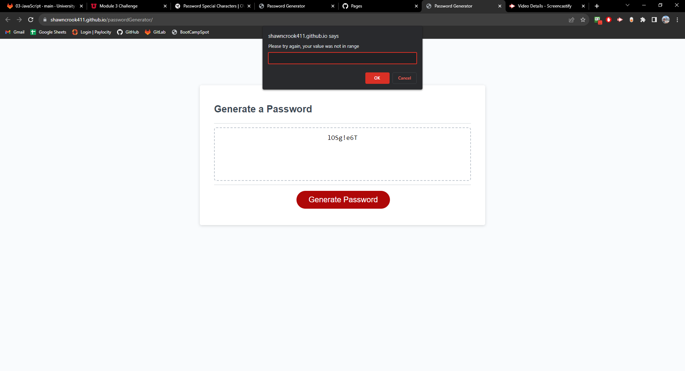

# Password Generator Starter Code

## Description
This is a webpage to create a randomly generated password!
First it will ask you how long you would like to be
Then it will ask a few prompts if you would like to include: uppercase letters, lowercase letters, special characters, or numbers!
If you don't select any characters, you will be prompt you for include characters again

Then it will display a password given the characters you allowed and the length specified.
You can press "Generate" again and it will display a new password

## Table of Contents
This is probably too short of a README to require a Table of Contents...

## Installation
No installation required! N/A

## Usage
Visit the following link :

https://shawncrook411.github.io/passwordGenerator

The actual repo can be found here :

https://github.com/shawncrook411/portfolioChallenge

## Screenshots
Here's a screenshot of the screen

## Contributions
The starter code was from git-lab
The HTML, and CSS were reused, as well as the generate button JS

Credit: https://git.bootcampcontent.com/University-of-Utah/UofU-VIRT-FSF-PT-08-2023-U-LOLC

## Tests
Check and see if the generate Password button displays a password on the screen!

